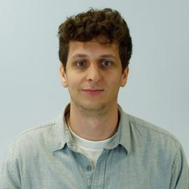
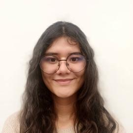
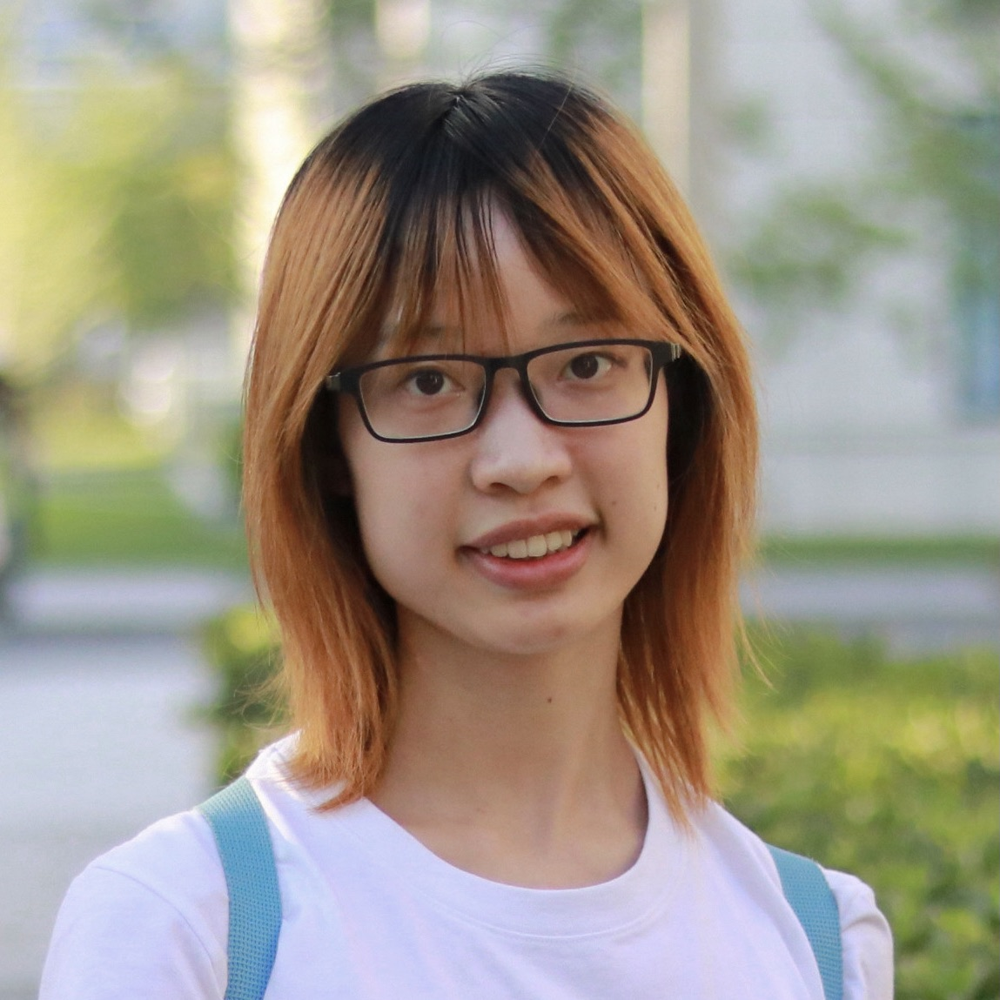
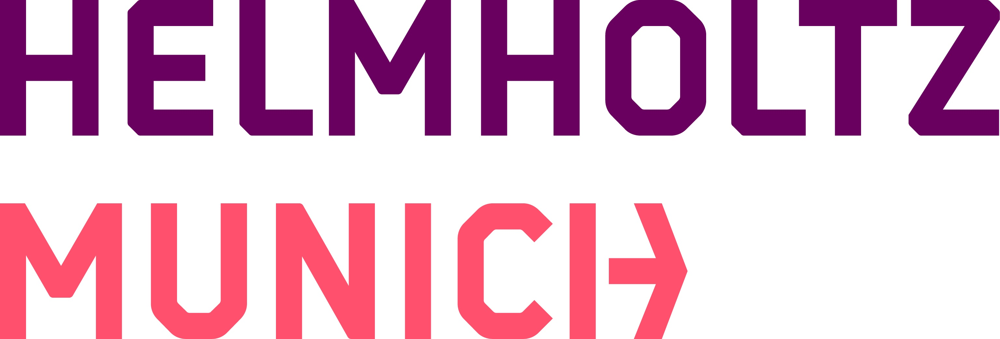

# MultiTab 2026

### MICCAI Workshop on Multimodal Learning with Medical Tabular Data

**Website:** https://multitab-miccai-2026.github.io/

---

## Overview

**MultiTab 2026** is a MICCAI workshop dedicated to multimodal learning with medical tabular data, including electronic health records, laboratory measurements, omics data, and other structured clinical variables.

The workshop focuses on methods that model tabular clinical data effectively and combine them with medical imaging and other complementary modalities such as text, signals, and time series. Our goal is to bring together researchers working on robust, clinically meaningful, and trustworthy multimodal AI.

## Scope

The workshop welcomes contributions on:

- multimodal fusion of imaging and tabular data
- foundation models for multimodal medical learning
- robustness, trustworthiness, and interpretability
- benchmarking and reproducibility
- handling missingness, heterogeneity, and domain shift

## Important Dates

| Milestone | Date |
| --- | --- |
| Paper submission deadline | May 15, 2026 |
| Abstract submission deadline | May 20, 2026 |
| Acceptance notification | June 15, 2026 |
| Workshop date | October 6, 2026 |

## Organizers

<table align="center">
  <tr>
    <td align="center" width="180">
       
      <strong>Maxime Di Folco</strong> 
      Telecom Paris
    </td>
    <td align="center" width="180">
       
      <strong>Chen Qin</strong> 
      Imperial College London
    </td>
    <td align="center" width="180">
       
      <strong>Laura Daza</strong> 
      Helmholtz Munich and TUM
    </td>
    <td align="center" width="180">
       
      <strong>Nikola Simidjievski</strong> 
      Telecom Paris
    </td>
  </tr>
  <tr>
    <td align="center" width="180">
       
      <strong>Julia Schnabel</strong> 
      Helmholtz Munich and TUM
    </td>
    <td align="center" width="180">
       
      <strong>Marta Hasny</strong> 
      Helmholtz Munich and TUM
    </td>
    <td align="center" width="180">
       
      <strong>Jun Li</strong> 
      Technical University of Munich
    </td>
    <td align="center" width="180">
       
      <strong>Siyi Du</strong> 
      Imperial College London
    </td>
  </tr>
</table>

## Organized By

  
  
  
  
  

## More Information

Please visit the workshop website for the latest updates on the call for papers, keynote speakers, program details, and submission information:

**https://multitab-miccai-2026.github.io/**
